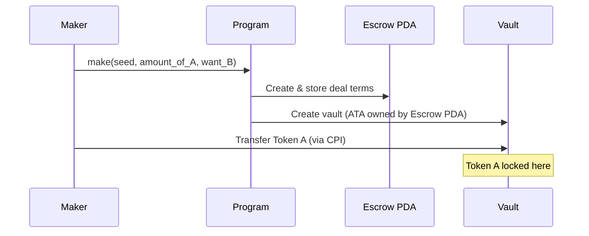
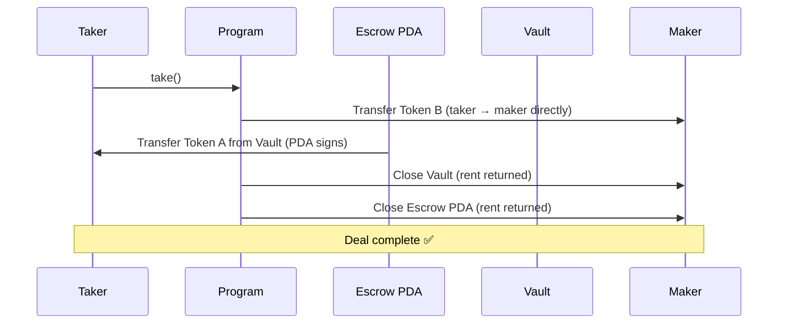
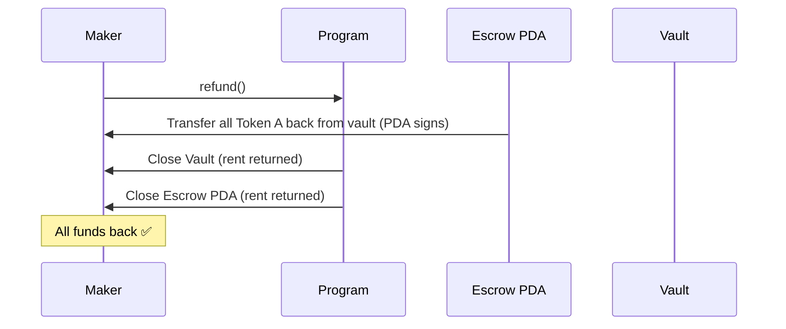
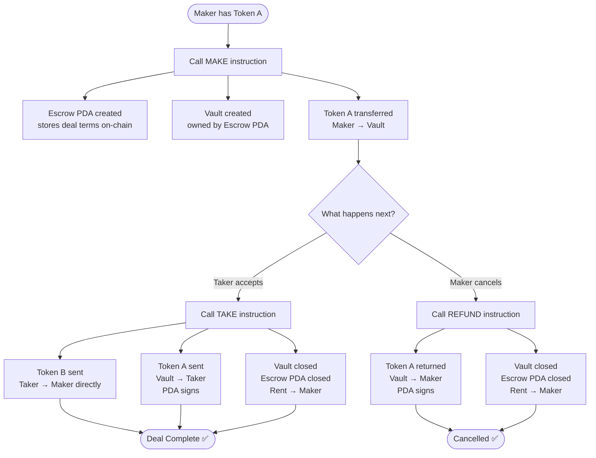

# 🔐 Anchor Escrow — Solana Smart Contract

A trustless token swap program built on Solana using the **Anchor** framework.  
Completed as part of the [Blueshift Anchor Escrow Challenge](https://learn.blueshift.gg/en/challenges/anchor-escrow).

---

## 🏆 Challenge Completed


> All 3/3 tests passed on Blueshift. NFT reward unlocked.

**Verify on-chain:**  
🔗 [View wallet on Solscan](https://solscan.io/account/8Pa6VsgN6KhtFTi27qCF6bdpjvYYGgMM6t7NocLD78QQ)

---

## 🤔 What Is An Escrow?

Imagine you want to trade your Apple Watch for someone's PlayStation.  
You don't want to hand over your watch first — what if they run away?  
They don't want to hand their PS5 first either — for the same reason.

**Escrow solves this.**

You both put your items in a locked box.  
Once both items are inside, the box opens automatically and gives each person the other's item.  
If no one shows up to trade, you just open the box and get your item back.

That's exactly what this program does — but with **SPL tokens on Solana**, and instead of a locked box, it's a **vault owned by a smart contract (PDA).**

---

## 🧠 Core Concept — What Is a PDA?

A **PDA (Program Derived Address)** is a special type of account on Solana.

- It looks like a wallet address
- But it has **no private key** — no human can sign for it
- Only the **program itself** can control it
- It's derived from seeds (like a password made from known inputs)

```
PDA = hash("escrow" + maker_wallet + seed_number)
```

This is how the vault is controlled — the escrow PDA owns the vault, and only the program logic can move funds out of it.

---

## 📁 Project Structure

```
src
├── instructions
│   ├── make.rs       ← Instruction 1: Create escrow & deposit Token A
│   ├── take.rs       ← Instruction 2: Accept deal & swap tokens
│   ├── refund.rs     ← Instruction 3: Cancel & get Token A back
│   └── mod.rs
├── state.rs          ← Escrow account data structure
├── error.rs          ← Custom error messages
└── lib.rs            ← Program entry point with discriminators
```

---

## 🗂️ The Escrow State Account

This is the data stored on-chain for each escrow deal:

```rust
pub struct Escrow {
    pub seed: u64,      // Random number — lets one maker open many escrows
    pub maker: Pubkey,  // Who created the deal
    pub mint_a: Pubkey, // Token being offered (Token A)
    pub mint_b: Pubkey, // Token being requested (Token B)
    pub receive: u64,   // How much Token B the maker wants
    pub bump: u8,       // PDA bump — cached to save compute
}
```

> The vault's balance tells us how much Token A is deposited.  
> We only need to store how much Token B we want in return.

---

## 🔄 The 3 Instructions

### 1️⃣ MAKE — Create the Escrow Deal

The **maker** decides the terms and deposits Token A into a vault.

```
Maker Wallet ──[Token A]──► Vault (owned by Escrow PDA)
                             + Escrow account created on-chain
                               storing: maker, mint_a, mint_b, receive amount
```

**What happens in code:**
1. Anchor creates the **Escrow** account (PDA) with the trade terms
2. Anchor creates the **Vault** (an ATA owned by the Escrow PDA)
3. Token A is transferred from `maker_ata_a` → `vault` via CPI



---

### 2️⃣ TAKE — Accept the Deal

The **taker** sends Token B to the maker and receives Token A from the vault.  
Both transfers happen **atomically** — either both succeed or nothing happens.

```
Taker Wallet ──[Token B]──► Maker Wallet
Vault        ──[Token A]──► Taker Wallet
Vault closed, Escrow PDA closed (rent returned to Maker)
```

**What happens in code:**
1. Taker sends `escrow.receive` amount of Token B → directly to maker
2. Escrow PDA signs (using signer seeds) → vault sends Token A → taker
3. Vault account is **closed** (rent goes back to maker)
4. Escrow account is **closed** (rent goes back to maker)



---

### 3️⃣ REFUND — Cancel the Deal

The **maker** changes their mind. They get Token A back and everything is closed.

```
Vault ──[Token A]──► Maker Wallet
Vault closed, Escrow PDA closed (rent returned to Maker)
```

**What happens in code:**
1. Escrow PDA signs → vault sends all Token A back → maker
2. Vault account is **closed**
3. Escrow account is **closed**



---

## 🔐 Security — How Does the Vault Stay Safe?

The vault is a token account whose **authority is the Escrow PDA**.

To move funds out of the vault, you need the PDA to sign.  
PDAs can't sign on their own — only the program can create a PDA signature using **signer seeds**:

```rust
let signer_seeds: [&[&[u8]]; 1] = [&[
    b"escrow",
    maker_key.as_ref(),
    seed_ref.as_ref(),
    &[self.escrow.bump],
]];

CpiContext::new_with_signer(token_program, transfer_accounts, &signer_seeds)
```

The seeds must match exactly what was used to create the PDA.  
If they don't match → wrong PDA → signature fails → transfer blocked.  
**No one can steal funds.**

---

## 📊 Complete Flow Diagram



---

## ⚙️ Instruction Discriminators

This program uses **custom discriminators** (requires Anchor 0.31.0+):

| Instruction | Discriminator |
|---|---|
| `make` | `0` |
| `take` | `1` |
| `refund` | `2` |

The state account `Escrow` also uses a custom discriminator of `1`.

---

## 🛠️ How To Build

```bash
# Install dependencies
anchor build

# The compiled .so file will be at:
# target/deploy/blueshift_anchor_escrow.so
```

**Requirements:**
- Anchor 0.31.0+
- Solana CLI
- Rust

---

## 📦 Key Dependencies

```toml
anchor-lang = { features = ["init-if-needed"] }
anchor-spl  # for SPL Token and Token-2022 support
```

The `idl-build` feature in `Cargo.toml`:
```toml
idl-build = ["anchor-lang/idl-build", "anchor-spl/idl-build"]
```

---

## 💡 What I Learned — Real Bugs I Hit

**1. Account ordering matters**  
Anchor processes accounts positionally in the IDL. Having `vault` in the wrong slot caused `AccountNotInitialized` even though the vault existed on-chain. Reordering fixed it.

**2. `init_if_needed` vs `mut`**  
For Refund, the maker's Token A ATA (`maker_ata_a`) might not exist if the test runs in isolation. Using `mut` (which expects an existing account) causes failure. `init_if_needed` handles both cases.

**3. PDA signing for CPI**  
Moving tokens out of a vault owned by a PDA requires `CpiContext::new_with_signer` with the exact seeds used to derive the PDA. Wrong seeds = wrong PDA address = transfer blocked.

---

## 🔗 Resources

- [Blueshift Anchor Escrow Challenge](https://learn.blueshift.gg/en/challenges/anchor-escrow)
- [Anchor Documentation](https://www.anchor-lang.com/)
- [SPL Token Program](https://spl.solana.com/token)
- [Solana Cookbook — PDAs](https://solanacookbook.com/core-concepts/pdas.html)

---

## 📂 Other Contracts in this Workspace
- 🏦 [Anchor Vault Challenge](../vault/README.md) — A secure vault program for depositing and withdrawing SOL.
